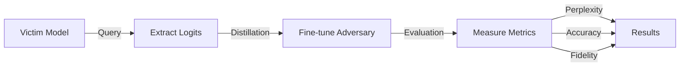

# Model Extraction Attack on Small Open LLMs

## 📋 프로젝트 개요

이 프로젝트는 소규모 오픈소스 LLM에 대한 **Model Extraction Attack**을 구현하고 평가합니다.

- **Victim Model**: GPT-2 (124M parameters)
- **Adversary Model**: DistilGPT-2 (82M parameters)
- **Attack Method**: Knowledge Distillation using Logits
- **Dataset**: Wikitext-2-raw-v1
- **Evaluation**: Perplexity, Accuracy, Fidelity

## 🚀 빠른 시작

### 1️⃣ 설치
```bash
pip install torch transformers datasets numpy tqdm matplotlib seaborn pandas
```

### 2️⃣ 데모 실행 (선택사항)
```bash
# Windows
demo_extraction.bat

# Linux/Mac
python demo_extraction.py
```

### 3️⃣ 빠른 테스트
```bash
# Windows
quick_extraction_test.bat

# Linux/Mac
python quick_extraction_test.py
```

### 4️⃣ 전체 실험
```bash
# Windows
run_extraction.bat

# Linux/Mac
./run_extraction.sh
```

### 5️⃣ 결과 확인
```bash
python compare_extraction_results.py
```

## 📊 예상 결과

| Model | Perplexity | Accuracy | Fidelity@top-1 |
|-------|-----------|----------|----------------|
| GPT-2 (victim) | 51.32 | 32.53% | 100% |
| DistilGPT-2 (baseline) | 51.32 | 28.10% | 79.40% |
| Fine-tuned (1000 samples) | 84.68 | 27.46% | **99.00%** |
| Fine-tuned (10000 samples) | 173.18 | 21.54% | **98.80%** |

### 핵심 발견
- ✅ Fidelity가 79% → 99%로 증가 (성공적인 extraction)
- ⚠️ Perplexity가 증가 (일반화 성능 저하)
- 📊 Trade-off: 높은 fidelity vs 낮은 일반화 성능

## 📁 프로젝트 구조

```
extraction-attack/
│
├── 🎯 실험 코드
│   ├── extraction_attack.py              # 메인 실험 스크립트
│   ├── compare_extraction_results.py     # 결과 분석 및 시각화
│   ├── quick_extraction_test.py          # 빠른 테스트
│   └── demo_extraction.py                # 대화형 데모
│
├── 🔧 실행 스크립트
│   ├── run_extraction.bat                # Windows 전체 실험
│   ├── run_extraction.sh                 # Linux/Mac 전체 실험
│   ├── quick_extraction_test.bat         # Windows 빠른 테스트
│   └── demo_extraction.bat               # Windows 데모
│
└── 📚 문서
    ├── EXTRACTION_README.md              # 이 파일
    ├── EXTRACTION_QUICKSTART.md          # 빠른 시작 가이드
    ├── EXTRACTION_ATTACK_GUIDE.md        # 상세 가이드
    └── EXTRACTION_PROJECT_SUMMARY.md     # 프로젝트 요약
```

## 🎓 배울 수 있는 것

1. **Model Extraction Attack** 원리와 구현
2. **Knowledge Distillation** 기법
3. **언어 모델 평가 지표** (Perplexity, Accuracy, Fidelity)
4. **PyTorch & Transformers** 라이브러리 활용
5. **실험 설계 및 결과 분석**

## ⚙️ 커스터마이징

### 다른 데이터 크기로 실험
```bash
python extraction_attack.py --train_samples 5000
```

### 다른 모델로 실험
```bash
python extraction_attack.py --victim_model gpt2-medium
```

### Loss 함수 조정
```bash
# Fidelity 우선
python extraction_attack.py --alpha 0.8

# Accuracy 우선
python extraction_attack.py --alpha 0.2
```

## 📈 평가 지표

### Perplexity (PPL)
- 언어 모델의 불확실성 측정
- **낮을수록 좋음**
- `PPL = exp(average loss)`

### Accuracy (ACC)
- 다음 토큰 예측 정확도
- **높을수록 좋음**
- 실제 성능 지표

### Fidelity@top-1 (FID)
- Victim 모델 모방 정도
- **높을수록 성공적인 공격**
- Extraction 성공 여부 측정

## 🔍 실험 워크플로우



## ⏱️ 예상 실행 시간

- **데모**: 1-2분
- **빠른 테스트**: 1-2분
- **1,000 샘플 실험**: 10-15분
- **10,000 샘플 실험**: 30-60분

(GPU 사용 시 더 빠름)

## 🛠️ 문제 해결

### CUDA Out of Memory
```bash
python extraction_attack.py --batch_size 8 --max_length 64
```

### 느린 실행 속도
- CUDA 설치 확인
- 배치 크기 조정
- 샘플 수 줄이기

### 모델 다운로드 실패
- 인터넷 연결 확인
- Hugging Face Hub 접근 확인

## 📚 문서 가이드

| 문서 | 내용 | 대상 |
|------|------|------|
| **EXTRACTION_README.md** | 프로젝트 개요 및 빠른 시작 | 모든 사용자 |
| **EXTRACTION_QUICKSTART.md** | 5분 안에 시작하기 | 초보자 |
| **EXTRACTION_ATTACK_GUIDE.md** | 상세한 사용법 및 이론 | 고급 사용자 |
| **EXTRACTION_PROJECT_SUMMARY.md** | 실험 결과 및 분석 | 연구자 |

## 🔐 윤리 및 보안

⚠️ **경고**: 이 프로젝트는 교육 목적입니다.

- 실제 상용 모델에 대한 무단 공격은 불법입니다
- 모델 제공자의 서비스 약관을 준수하세요
- 연구 및 학습 목적으로만 사용하세요

### 방어 기법
1. **Logits 은닉**: Top-k만 반환
2. **Query 제한**: 요청 수 제한
3. **Output Perturbation**: 노이즈 추가
4. **Model Watermarking**: 모델 워터마킹

## 📖 참고 문헌

### 핵심 논문
- Tramèr et al. (2016) - "Stealing Machine Learning Models via Prediction APIs"
- Hinton et al. (2015) - "Distilling the Knowledge in a Neural Network"
- Jagielski et al. (2020) - "High Accuracy and High Fidelity Extraction"

## 🤝 기여

버그 리포트, 기능 제안, Pull Request를 환영합니다!

## 📝 라이선스

이 프로젝트는 교육 목적으로 제공됩니다.

---

**더 자세한 정보는 다른 문서를 참고하세요:**
- 🚀 [빠른 시작](EXTRACTION_QUICKSTART.md)
- 📖 [상세 가이드](EXTRACTION_ATTACK_GUIDE.md)
- 📊 [프로젝트 요약](EXTRACTION_PROJECT_SUMMARY.md)


